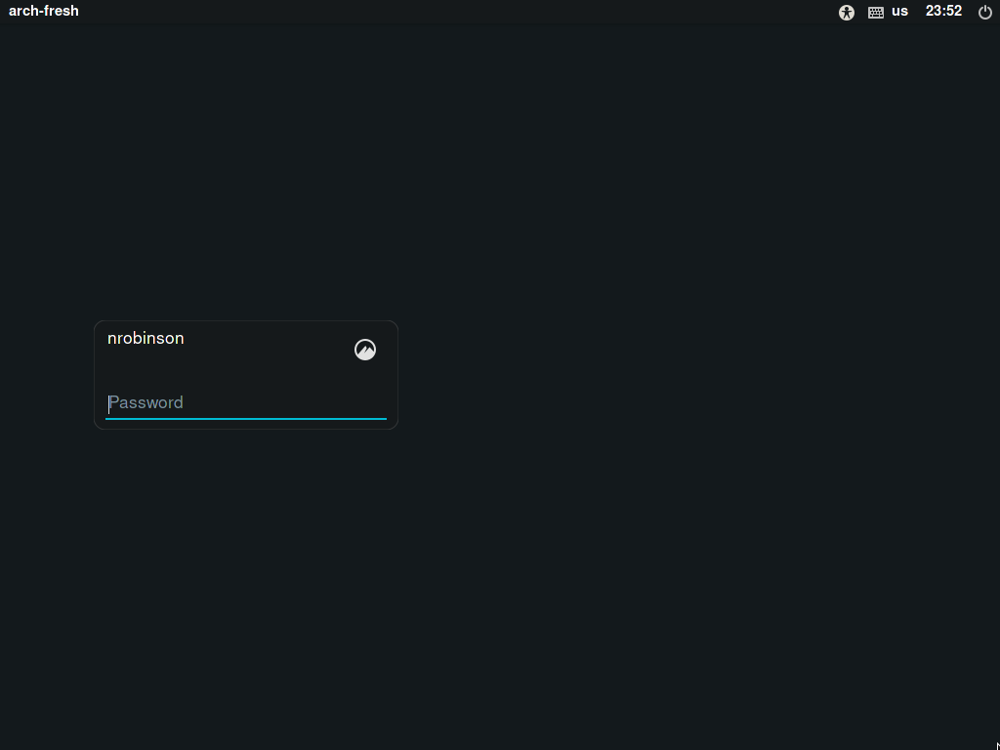
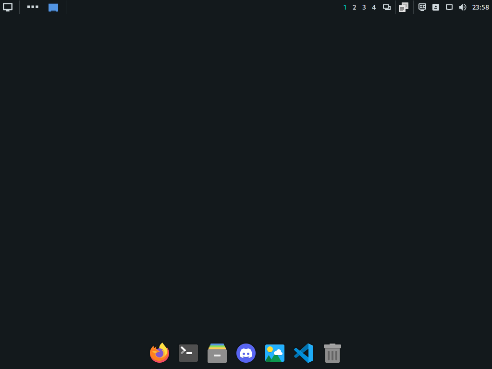

# dotfiles-plus

Similar to [arch-base](https://github.com/nrobinson2000/arch-base) but more
concise. All future documentation of my Arch Linux setup will be kept here.

## Installation

After installing Arch Linux, log in as a non-root user with sudo access.

Run the following to install my packages and settings to replicate my desktop environment:

```
./install
```

After the script completes, reboot your system. You should be presented with a
graphical login on boot.

> Since this script does not make any assumptions about your graphics card or
bootloader you should install and configure the appropriate packages if necessary.

## Recording

[](https://asciinema.org/a/446096)

## Screenshots



Login window featuring [lightdm-slick-greeter](https://archlinux.org/packages/community/x86_64/lightdm-slick-greeter)



Cinnamon desktop environment featuring [adapta theme](https://archlinux.org/packages/community/any/adapta-gtk-theme) and [plank dock](https://archlinux.org/packages/community/x86_64/plank)


## Notes

This script was designed with good intentions and to speed up the process of
installing my desktop environment settings on Arch Linux. There may be bugs and
I do not accept any liability for damage this script may cause to your system.
